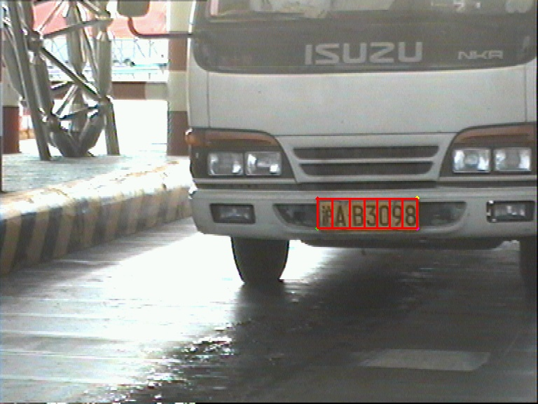
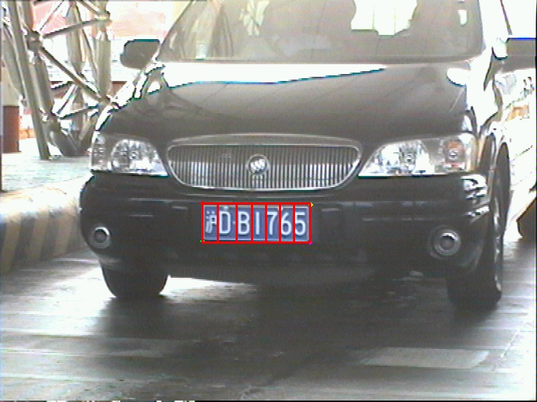

# Digital Image Processing Homework: License Plates Landmarks Detection

This repository contains code for digital image processing homework in 2024 spring semester, UCAS. The code implements the recognition of landmarks of license plates. Using the landmarks, we achieve localization and isometric segmentation of license plates.

Any questions and discussions please email: shipingfuucas@gmail.com

## Dataset and Annotation

The dataset contains two parts, the CCPD2019 dataset mainly provides blue license plates, while the yellow license plate data comes from *aistudio.baidu.com*.

from ``./data/wider_face.py``, the dataset has the following catalog format:

```Shell
  ./data/widerface/
    train/
      images/
      label.txt
    val/
      images/
      wider_val.txt
    test/
      images/
```

train for training dataset, val for validation dataset, and test for test dataset.

And for every ``label.txt``, The format is:

```Shell
  # image name
  x y w h x1 y1 0.0 x2 y2 0.0 x3 y3 0.0 x4 y4 0.0 
```

x, y for upper left corner coordinates of license plate; w, h for width and height; and the next four coordinates correspond to upper left, upper right, lower right and lower left, each separated by 0.0.

``./utils/label_annotation.py`` can change the annotation format of the original dataset to the current annotation format.

## Train and Detect

1. Before training you can change some configuration in ``./data/config.py``. And the trained models will be saved in ``./weights``.
2. Some detection configuration could be modified in ``./detect.py``. The results of detection will be saved in ``./detect``.
3. The detection result contains 4 landmarks and some segmentation frame of plates.

## Segmentation Results

<p align="center"></p>

## References
- [Plate Landmarks detection](https://github.com/Fanghc95/Plate-Landmarks-detection/blob/main/README.md?plain=1)
- [[ECCV 2018] CCPD: a diverse and well-annotated dataset for license plate detection and recognition](https://github.com/detectRecog/CCPD?tab=readme-ov-file#dataset-annotations)
- [Some yellow plates dataset](https://aistudio.baidu.com/datasetdetail/175158)
